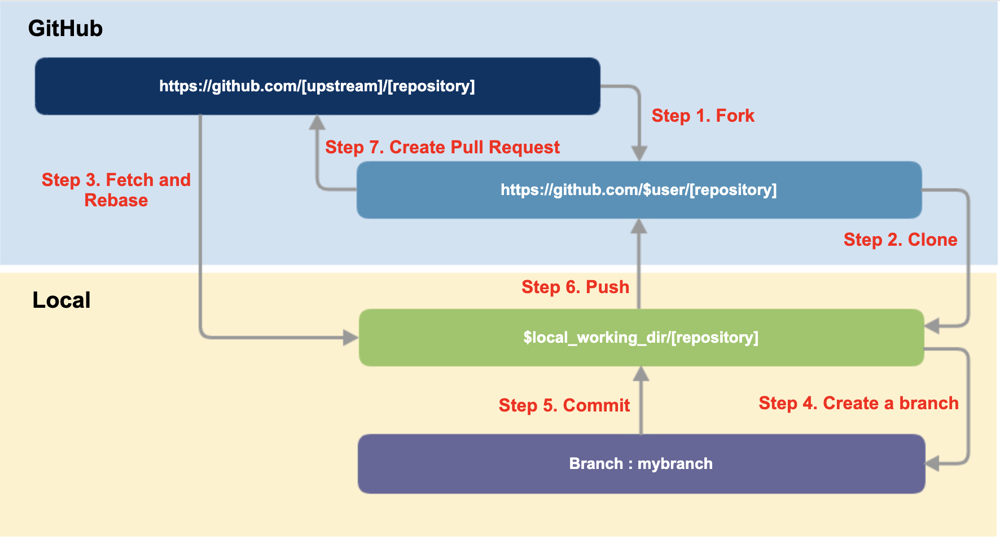

# How to contribute

This section describes the detailed process for submitting contributions.


**Reference**

This page refers to the contents of [the Open Source Guide of GitHub](https://opensource.guide) & [SKT Open Source Guide](https://sktelecom.github.io/guide/).


The method and procedure for submitting a contribution to a general open source project are as follows.

## 1. Check previous history

Make sure the contribution you are submitting hasn't been discussed elsewhere before. Check the project's README, issues, and mailing lists. Instead of having to check all the documents, you can easily find them by searching for a few keywords.

If you can't find anything relevant in the previous material, it's time to open an issue or initiate a communication through a Pull Request. GitHub provides Issues and Pull Requests.

* Issues: You can start a conversation or discussion.
* Pull Request: You can start work on solution to a problem.

Before opening an Issue or Pull Request, check the documentation provided by the project (usually CONTRIBUTING or README) to see how and how to contribute. For example, it may ask that you follow a specific template, or require that you use tests.

It's also a good idea to open Issues before you start working on a contribution to let community members know what you're working on first. Sometimes it can help you avoid unnecessary work.

## 2. Opening an Issue <a href="#2-issue" id="2-issue"></a>

In general, an issue is created in the following situations.

* Report errors that can't solve yourself
* Propose a new feature or idea
* Discussion of community vision, or policies


**Tips for communicating on issues:**

* **If you see an open issue that you want to tackle,** comment on the issue to let people know you’re on it. That way, people are less likely to duplicate your work.
* **If an issue was opened a while ago,** it’s possible that it’s being addressed somewhere else, or has already been resolved, so comment to ask for confirmation before starting work.
* **If you opened an issue, but figured out the answer later on your own,** comment on the issue to let people know, then close the issue. Even documenting that outcome is a contribution to the project.


## 3. Opening a pull request

You should usually open a pull request in the following situations:

* Submit trivial fixes (for example, a typo, a broken link or an obvious error)
* Start work on a contribution that was already asked for, or that you’ve already discussed, in an issue

A pull request doesn’t have to represent finished work. It’s usually better to open a pull request early on, so others can watch or give feedback on your progress. Just mark it as a “WIP” (Work in Progress) in the subject line. You can always add more commits later.

### Pull Request Procedure on GitHub

If the project is on GitHub, you can refer to the following when submitting a Pull Request.



#### **Step 1. Fork**

Fork the Upstream Repository to your GitHub account.

#### **Step 2. Clone**

Clone the forked Repository to the local working directory of the asset.

```
$ mkdir -p $working_dir
$ cd $working_dir
$ git clone https://github.com/$user/[repository]
```

Add Upstream Repository to Remote.

```
$ cd [repository]
$ git remote add upstream https://github.com/[upstream]/[repository]
 
# Confirm that your remotes make sense:
$ git remote -v
```

#### **Step 3. Create a branch**

First, fetch and rebase the main branch to keep it up to date.

```
$ cd $working_dir/[repository]
$ git fetch upstream
$ git checkout main
$ git rebase upstream/main
```

And create a branch (myfeature) for development.

```
$ git checkout -b myfeature
```

#### **Step 4. Keep your branch in sync**

Fetch and rebase Branch to keep it up to date.

```
# While on your myfeature branch
$ git fetch upstream
$ git rebase upstream/main
```

In that state, work on the code.

#### **Step 5. Commit**

Commit the modifications.

```
$ git commit -a -m '[commit message]'
```

#### **Step 6. Push**

Push the modifications of myfeature branch to your GitHub Repository.

```
git push -f origin myfeature
```

#### **Step 7. Create a pull request**

If you go to your repository on GitHub, you can see that the Compare & pull request button is enabled. Click it to create a Pull Request.

After that, the manager of the Upstream Repository reviews the requested Pull Request and decides whether to merge or not.


**References**

* If this is your first pull request, check out [Make a Pull Request](http://makeapullrequest.com), which [@kentcdodds](https://github.com/kentcdodds) created as a walkthrough video tutorial. You can also practice making a pull request in the [First Contributions](https://github.com/Roshanjossey/first-contributions) repository, created by [@Roshanjossey](https://github.com/Roshanjossey).
* For reference, Kubernetes provides an explanation document for the following Github workflow. : [github\_workflow.md](https://github.com/kubernetes/community/blob/master/contributors/guide/github-workflow.md)


